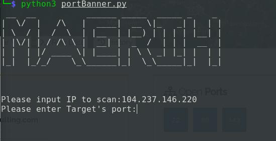
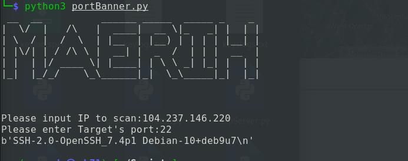
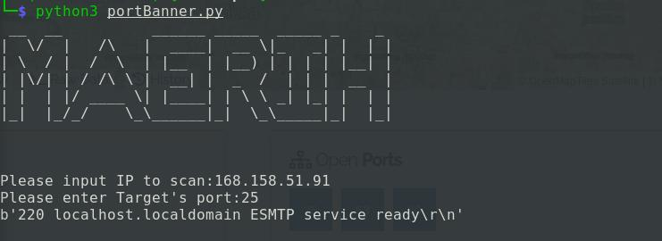

# Port-Scanner
A port scanner which can be used inplace of nmap.

1. Run `python3 Port-Scanner.py` on the cmd prompt or Terminal.

2. Input `IP` and `port` to scan.

3. Wait for the output on console.

#### This tool is essential for System Administators where they can be aware of the open ports in their system.
